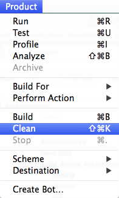

<a name="top">

<a name="hide-banner" />

### Hiding your banner
You can hide and show your banner in run time, using ``showBanner`` and ``hideBanner`` methods:
```objectivec
[bannerView showBanner];
[bannerView hideBanner];
```

[Back to top](#top)

<a name="ControllingBannerSize" />

### Controlling the size of your banner
The size of the banner is determined by the "size" parameter which can receive one of the following values

Value | Size | Best fits for
--- | --- | ---
*`STA_AutoAdSize`* | Auto-size (recommended) | detects the width of the device's screen in its current orientation, and provides the optimal banner for this size
*`STA_PortraitAdSize_320x50`* | 320x50 | iPhone/iPod touch in portrait mode
*`STA_LandscapeAdSize_480x50`* | 480x50 | iPhone/iPod touch in landscape mode
*`STA_PortraitAdSize_768x90`* | 768x90 | iPad in portrait mode
*`STA_LandscapeAdSize_1024x90`* | 1024x90 | iPad in landscape mode

[Back to top](#top)

<a name="UsingBannerDelegates" />

### Using banner delegates
Set your view controller as a delegate so it is able to receive callbacks from the banner ad.

1. Add the STABannerDelegateProtocol to the header file
 ```objectivec
 @interface YourViewController : UIViewController <STABannerDelegateProtocol>
 {
     STABannerView* bannerView;  
 } 
 ```

2. Use "withDelegate:self" when initializing the STABannerView object:
 ```objectivec
 bannerView = [[STABannerView alloc] initWithSize:STA_AutoAdSize 
                                      autoOrigin:STAAdOrigin_Top                 
                                      withView:self.view 
                                      withDelegate:self];
 ```

3. Implement the following functions:
 ```objectivec
- (void) didDisplayBannerAd:(STABannerView*)banner;
- (void) failedLoadBannerAd:(STABannerView*)banner withError:(NSError *)error;
- (void) didClickBannerAd:(STABannerView*)banner;
 ```

[Back to top](#top)

<a name="UsingFixedOriginBanner" />

### Using a fixed origin for your banner
If you choose to locate the banner in a fixed origin rather than the view's top or bottom, simply pass the required origin point (x,y) upon initialization as explain in the following example

Locating your banner 100 pixels above the view's bottom:
```objectivec
bannerView = [[STABannerView alloc] initWithSize:STA_AutoAdSize 
                                    origin:CGPointMake(0, self.view.frame.size.height - 100) 
                                    withView:self.view 
                                    withDelegate:nil];
```
To use a different banner origin in a specific layout, call the "setOrigin"/"setStartAppAutoOrigin" with the new origin value.

[Back to top](#top)

<a name="ChangingBanner" />

### Changing the banner size and origin upon rotation
If you choose to manually control the banner's size & origin upon rotation, you can do it in the didRotateFromInterfaceOrientation function. 

Example:
```objectivec
// YourViewController.m

- (void)didRotateFromInterfaceOrientation:(UIInterfaceOrientation)fromInterfaceOrientation {
    if (UIInterfaceOrientationIsPortrait(self.interfaceOrientation)) {
         [bannerView setOrigin:CGPointMake(0, 0)];
    } else {	
        [bannerView setOrigin:CGPointMake(0, 300)];
    }
    [super didRotateFromInterfaceOrientation:fromInterfaceOrientation];
}
```

[Back to top](#top)


<a name="UsingInterstitialObjects" />

## Implementing interstitial ads with objects

###### You can implement interstitial ad as an object if you need to gain more control over your ads, like using callbacks or using multiple ads with different properties. 

First, import the StartApp SDK in your view controller and add the following lines to the header file for each view in which you would like to show an ad
```objectivec
// YourViewController.h
 
#import <StartApp/StartApp.h>
 
@interface YourViewController : UIViewController 
{
    STAStartAppAd* startAppAd;    // ADD THIS LINE
} 
```

In your view controller init **STAStartAppAd** within the ``viewDidLoad()`` method and load it within the ``viewDidAppear()`` method. Remember to release **STAStatAppAd** object in your ``dealloc()`` method in case you're not using ARC in your project.
```objectivec
// YourViewController.m 

- (void)viewDidLoad {
    [super viewDidLoad];
    startAppAd = [[STAStartAppAd alloc] init];
}

- (void) viewDidAppear:(BOOL)animated {
    [super viewDidAppear:animated];
    [startAppAd loadAd];  // Add this line
}

- (void) dealloc {
    // Don't release startAppAd if you are using ARC in your project
    [startAppAd release];  // Add this line
    [super dealloc];
} 
```

Finally, add the following lines where you want to show the ad
```objectivec
[startAppAd showAd];
```

> **IMPORTANT**<br></br>
>Loading an ad might take a few seconds so it's important to show the ad as late as you can. In case you call ``showAd()`` while the ad hasn't been successfully loaded yet, nothing will be displayed.  For example, if you'd like to show an ad after completing a game's level, the best practice would be to show the ad upon completing the level (for example in your ``viewDidDisappear()`` function). On the other hand, loading and showing the ad together at the beginning of the next level might result with a failure – as the ad might not have enough time to load.

[Back to top](#top)


<a name="UsingInterstitialDelegate" />

### Using Interstitial delegates
Set your view controller as a delegate so it is able to receive callbacks from the interstitial ad.

1. Add the STADelegateProtocol to the header file
 ```objectivec
 @interface YourViewController : UIViewController <STADelegateProtocol>
 {
     STAStartAppAd* startAppAd;    
 } 
 ```

2. Use "withDelegate:self" when calling the loadAd function:
 ```[startAppAd loadAd:STAAdType_Automatic withDelegate:self]```

3. Implement the following functions:
 ```objectivec
 - (void) didLoadAd:(STAAbstractAd*)ad;
 - (void) failedLoadAd:(STAAbstractAd*)ad withError:(NSError *)error;
 - (void) didShowAd:(STAAbstractAd*)ad;
 - (void) failedShowAd:(STAAbstractAd*)ad withError:(NSError *)error;
 - (void) didCloseAd:(STAAbstractAd*)ad;
 - (void) didClickAd:(STAAbstractAd*)ad;
 ```

[Back to top](#top)

<a name="CustomizingSplashScreen" />

## Customizing your Splash Screen
You can customize the appearance of your splash screen using the ``STASplashPreferences`` object, as describes below. In order to use splash preferences, use the ``showSplashAdWithPreferences`` method when initializing the splash screen in your _AppDelegate_ class.

For example - using splash preferences to choose template mode:
```objectivec
STASplashPreferences *splashPreferences = [[STASplashPreferences alloc] init];
splashPreferences.splashMode = STASplashModeTemplate;
[sdk showSplashAdWithPreferences:splashPreferences];
```

### Splash Preferences API
The following API describes all customization options available for the splash screen.

#### ►Splash screen mode
Decide whether to use user-defined or template mode.

**Parameter:** _splashMode_

**Values:**   
_STASplashModeUserDefined_  
_STASplashModeTemplate_  

**Usage:**  
``splashPreferences.splashMode = STASplashModeTemplate;``

#### ►Change splash image (for user-defined mode)
Change the splash screen image, instead of using the default one. 

**Parameter:** _splashUserDefinedImageName_  

**Usage:**  
``splashPreferences.splashUserDefinedImageName = @"MyImage";``  

#### ►Choosing splash template (for template mode)
Choose of of 6 pre-designed templates.

**Parameter:** _splashTemplateTheme_  

**Values:**   
_STASplashTemplateThemeDeepBlue_  
_STASplashTemplateThemeSky_  
_STASplashTemplateThemeAshenSky_  
_STASplashTemplateThemeBlaze_  
_STASplashTemplateThemeGloomy_  
_STASplashTemplateThemeOcean_  

**Usage:**  
``splashPreferences.splashTemplateTheme = STASplashTemplateThemeBlaze;``  

#### ►Changing template's icon and title (for template mode)
The SDK uses your default application's name and icon. You can choose however to use your own assets.

**Parameters:**   
_splashTemplateIconImageName_   
_splashTemplateAppName_    

**Usage:**  
```objectivec
splashPreferences.splashTemplateIconImageName = @"MyIcon";
splashPreferences.splashTemplateAppName = @"MyAppName";
```


#### ►Enable/Disable loading indicator (for user-defined mode)
Choose whether to display a loading indicator on the splash screen.

**Parameter:** _isSplashLoadingIndicatorEnabled_  

**Values:**   
_YES_  
_NO_  

**Usage:**  
``splashPreferences.isSplashLoadingIndicatorEnabled = YES;``  

#### ►Choose loading indicator's type (for user-defined and template modes)
Choose which loading indicator type to display: iOS default activity indicator or a "dots" loading indicator

**Parameter:** _splashLoadingIndicatorType_  

**Values:**   
_STASplashLoadingIndicatorTypeIOS_  
_STASplashLoadingIndicatorTypeDots_  

**Usage:**  
``splashPreferences.splashLoadingIndicatorType = STASplashLoadingIndicatorTypeDots;``  

#### ►Change loading indicator's position (for user-defined mode)
The loading indicator is displayed by default on the center of the screen. You can choose however to set a custom position.

**Parameter:** _splashLoadingIndicatorCenterPoint_  

**Values:**   
_CGPointMake(x, y)_  

**Usage:**  
``splashPreferences.splashLoadingIndicatorCenterPoint = CGPointMake(100, 100);``  


#### ►Force landscape orientation (for user-defined and template modes)
The SDK display the splash screen using the orientation supported by the application and the device real orientation. You can choose however to force landscape orientation.

**Parameter:** _isLandscape_  

**Values:**   
_YES_  
_NO_  

**Usage:**  
``splashPreferences.isLandscape = YES;``  

[Back to top](#top)


<a name="table-view" />

### Showing banners in UITableView
If you would like to load a banner into a UITableView instead of a general UIView, follow these instructions:

1. Declare an **STABannerView** instance variable in your UITableView class

 ```objectivec
 @interface YourViewController ()
 {
     STABannerView* bannerview;
 }
 @end
 ```
 
2. Override the ``cellForRowAtIndexPath`` method, and add the required code:

 ```objectivec
  - (UITableViewCell *)tableView:(UITableView *)tableView cellForRowAtIndexPath:(NSIndexPath *)indexPath {
     static NSString *CellIdentifier = @"Cell";
     UITableViewCell *cell=nil;
     cell = [tableView dequeueReusableCellWithIdentifier:CellIdentifier];
     
     if (cell == nil)  {
         cell = [[UITableViewCell alloc] initWithStyle:UITableViewCellStyleDefault  reuseIdentifier:CellIdentifier]; 
     }
    
    
     // ADD THE FOLLOWING LINES
     if(bannerview == nil)
     {
         bannerview = [[STABannerView alloc] initWithSize:STA_AutoAdSize autoOrigin:STAAdOrigin_Top  withView:cell withDelegate:self]; 
     }
    
     [bannerview addSTABannerToCell:cell withIndexPath:indexPath atIntexPathRow:2 repeatEach:8];
    
     return cell;
 }
```

 Use the ``addSTABannerToCell`` method to set the banner's position and frequency:
 + ``atIntexPathRow`` - set the cell where you want to show the banner
 + ``repeatEach`` - set repetition frequency

 In the above example, the banner will be displayed at the second cell, and will be repeated each 8 cells.

[Back to top](#top)

<a name="UpgradeSDK" />

### Upgrading from an old SDK
1. Remove all old StartApp files (including all .h and .m files, StartApp.bundle and StartApp.framework).  
2. Clean your project  

   

3. Continue to add the new StartApp SDK files to your project, as describes [here](iOS-InApp-Documentation#step1).  

[Back to top](#top)

<a name="using-native-ads" />

## Integrating Native Ads

### Initializing and Loading Native Ads  
First, import the StartApp SDK in your view controller and add the following lines to the header file for each view in which you would like to use StartApp Native ad.
```objectivec
// YourViewController.h

#import <StartApp/StartApp.h>

@interface YourViewController : UIViewController 
{
    STAStartAppNativeAd *startAppNativeAd;    // ADD THIS LINE
} 
```

In your view controller, initialize **STAStartAppNativeAd** within the ``viewDidLoad()`` method and load the ad with your selected preferences.
```objectivec
// YourViewController.m 

- (void)viewDidLoad 
{
    [super viewDidLoad];
    startAppNativeAd = [[STAStartAppNativeAd alloc] init];
    [startAppNativeAd loadAd];
}
```

You can check if the ad has been loaded, using  ``startAppNativeAd.adIsLoaded;``.

### Using Native Ad delegates
Set your view controller as a delegate so it is able to receive callbacks from the native ad.

1. Add the STADelegateProtocol to the header file
 ```objectivec
 @interface YourViewController : UIViewController <STADelegateProtocol>
 {
     STAStartAppNativeAd *startAppNativeAd;    
 } 
 ```

2. Implement the following functions
 ```objectivec
 - (void) didLoadAd:(STAAbstractAd*)ad;
 - (void) failedLoadAd:(STAAbstractAd*)ad withError:(NSError *)error;
 ```

3. Load an ad using ``loadAdWithDelegate``
 ```objectivec
 [startAppNativeAd loadAdWithDelegate:self];
 ```

### Using Native Ad Preferences
**STANativeAdPreferences** can be used to customize some of the native ad properties to suit your needs, such as the number of ads to load, the image size of the ad, or whether the image should be pre-cached or not. For a full description of the NativeAdPreferences object, please refer to [NativeAdPreferences API](#NativeAdPreferencesAPI).

In order to use the STANativeAdPreferences object, simply use it when loading the ad:
```
[startAppNativeAd loadAdWithNativeAdPreferences:pref];
```

Example: load a 150x150 ad and register for callbacks:  
```objectivec
// YourViewController.m 

- (void)viewDidLoad 
{
    [super viewDidLoad];
    startAppNativeAd = [[STAStartAppNativeAd alloc] init];
    STANativeAdPreferences *pref = [[STANativeAdPreferences alloc]init];
    pref.primaryImageSize = 4;     // Select 1200x628 primary image
	pref.secondaryImageSize = 2;     // Select 150x150 secondary icon	
    pref.autoBitmapDownload = YES;    // When set to NO no images will be downloaded by the SDK
		
    [startAppNativeAd loadAdWithDelegate:self withNativeAdPreferences:pref]; 
}
```

### Using the Native Ad Object
After initializing and loading your **STAStartAppNativeAd**  object, use the **STANativeAdDetails** object to get details of all returning ads. The STANativeAdDetails object provides access to each ad's details, such as the ad's title, description, image, etc. This object also provides methods for firing an impression once the ad is displayed, and for executing the user's click on the ad. For a full description of the **STAStartAppNativeAd** object, please refer to [NativeAdDetails API](#NativeAdDetailsAPI).

Example: get some details of the 1st ad.
```objectivec
STANativeAdDetails *adDetails = [startAppNativeAd.adsDetails objectAtIndex:1];
titleLabel.text=[[startAppNativeAd.adsDetails objectAtIndex:1] title];
descriptionLabel.text=[[startAppNativeAd.adsDetails objectAtIndex:1] description];
imageView.image=[[startAppNativeAd.adsDetails objectAtIndex:1] imageBitmap];
```

> **Note:** It is possible to get less ads than you requested. It is also possible that no ad will be returned. In this case you will receive an empty array.

### Showing and Clicking a Native Ad
Once you decide to actually show a native ad, you must call the ``[adDetails sendImpression]`` method.  
  
Once the user clicks on the ad, you must call ``[adDetails sendClick]`` method.  

<a name="NativeAdPreferencesAPI" />

### NativeAdPreferences API
Parameter name | Description | Values
--- | --- | ---
*`adsNumber `* | number of native ads to be retrieved | a number between 1-10
*`primaryImageSize `* | size of the primary image to be retrieved | Can take one of the following: <br><br>0 - image size of 72X72 <br>1 - image size of 100X100<br>2 - image size of 150X150<br>3 - image size of 340X340 <br>4 - image size of 1200X628 <br>5 - image size of 320X480<br>6 - image size of 480X320  
*`secondaryImageSize `* | size of the secondary image to be retrieved | Can take same values as the primary image, except the 1200x628 size
*`autoBitmapDownload `* | Select the method for retrieving the ad's icon. You can get the icon's URL only, or pre-cache it into a bitmap object | "YES"=pre cached, "NO"=URL only
*`userLocation.latitude`* | the device's latitude  | latitude
*`userLocation.longitude`* | the device's longitude | longitude

At the moment, sizes 5-6 can't be used together with sizes 0-4.

<a name="STANativeAdDetailsAPI" />

### STANativeAdDetails API
Parameter name | Description | Return value
--- | --- | ---
*`title`* | Get the Ad's title | NSString
*`description`* | Get the Ad's description | NSString
*`imageBitmap`* | Get the actual icon of the ad, according to the selected size (if autoBitmapDownload="YES") | UIImage
*`imageUrl`* | Get the primary image URL of the ad, according to the selected size (if autoBitmapDownload="NO") | NSString
*`secondaryImageUrl`* | Get the secondary image URL of the ad, according to the selected size (if autoBitmapDownload="NO") | NSString
*`category`* | Get the category of the ad in the App Store | NSString 
*`adId`* | Get the ad's package name in the App Store | NSString
*`rating`* | Get the rating of the ad in the App Store. The rating range is 1-5 | NSNumber 


[Back to top](#top)

<a name="Demographic" />

### Enjoy Higher eCPM with Demographic-Targeted Ads
If you know your user's gender, age or location, StartApp can use it to serve better-targeted ads which can increase your eCPM and revenue significantly.

#### Set Age and Gender
Upon initialization, after providing your AppId, use the following line:
```objectivec
sdk.preferences = [STASDKPreferences prefrencesWithAge:<USER_AGE> andGender:<USER_GENDER>];
```

+ Replace \<USER_AGE\> with the user's real age 
+ Replace \<USER_GENDER\> with the user's real gender, using *STAGender_Male* or *STAGender_Female*.

**Example**
```objectivec
// AppDelegate.m

#import <StartApp/StartApp.h>

- (BOOL)application:(UIApplication *)application 
didFinishLaunchingWithOptions:(NSDictionary *)launchOptions
{
    // initialize the SDK with your appID 
    STAStartAppSDK* sdk = [STAStartAppSDK sharedInstance];
    sdk.appID = @"your app Id";

    sdk.preferences = [STASDKPreferences prefrencesWithAge:22 andGender:STAGender_Male];

    return YES;
}
```

#### Set Location
The location of the user is a dynamic property which is changed constantly. Hence, you should provide it every time you load a new Ad:

```objectivec
[startAppAd loadAdWithAdPreferences:[STAAdPreferences prefrencesWithLatitude:<Real_Longitude> andLongitude:<Real_Latitude>]];
```

**Example**
```objectivec
- (void) viewDidAppear:(BOOL)animated {
    [super viewDidAppear:animated];

        [startAppAd loadAdWithAdPreferences:[STAAdPreferences prefrencesWithLatitude:37.3190383911 andLongitude:-121.96269989]];
}
```

[Back to top](#top)


