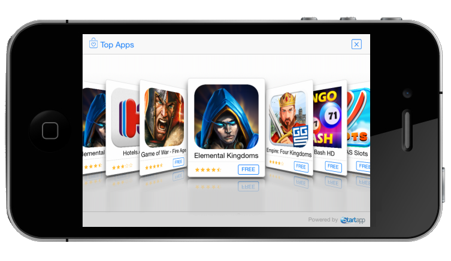

This document describes the basic procedure for integrating StartApp In-App Ads into your iOS applications. <br></br>
After this simple integration process, StartApp In-App Ads enables you to reap the benefits of StartApp's In-App monetization products, which maximize the revenue generated by your application. All this profit-making is achieved with minimal effort and minimal interference with your users’ experience.



> **NOTE:**
> - The code samples in this document can be copy/pasted into your source code
> - If you have any questions, contact us via [support@startapp.com](http://support@startapp.com)

<br></br>
<a name="step1" />
##Step 1, Add the StartApp SDK to your project
####Add the StartApp SDK files to your application project directory
1. Right-click on you project and choose "Add Files to…"
<br></br>[[/images/AddFilesTo.png]]
2. Add the StartApp SDK files:
<br></br> libStartAppAdSDK.a
<br></br> STAStartAppAd.h
<br></br> STABannerSize.h
<br></br> STABannerView.h
<br></br> StartAppAdSDK-resources.bundle
<br></br><br></br>[[/images/SdkFiles.png]]

####Add the libStartAppAdSDK.a to the Build Phases of the desired target
1.	Select your application project to bring up the project editor
2.	Select your application target to bring up the target editor
3.	Select the Build Phases tab
4.	Disclose the "Link Binary With Libraries" phase
5.	Make sure "libStartAppAdSDK.a" exists. if not, click the plus button in that phase, then click "Add Other…" and select the "libStartAppAdSDK.a" file 
<br></br><br></br>[[/images/libStartAppAdSDK.png]]

####Add the Bundle to the Build Phases of the desired target
1.	Select your application project to bring up the project editor
2.	Select your application target to bring up the target editor
3.	Select the Build Phases tab
4.	Disclose the "Copy Bundle Resources" phase 
5.	Make sure "StartAppAdSDK-resources.bundle" exists. if not, click the plus button in that phase, then click "Add Other…" and select the " StartAppAdSDK-resources.bundle" file 
<br></br><br></br>[[/images/StartAppAdSDK-resources.bundle.png]]

<a name="step2" />
##Step 2, Add frameworks
####Add the StartApp SDK files to your application project directory
1.	Select your application project to bring up the project editor
2.	Select your application target to bring up the target editor
3.	Select the Build Phases tab and disclose the "Link Binary with Libraries" phase and click the plus button in that phase
4.	Add the following frameworks:
<br></br> CoreTelephony.framework 
<br></br> SystemConfiguration.framework 
<br></br> CoreGraphics.framework 
<br></br> StoreKit.framework 
<br></br> AdSupport.framework 
<br></br><br></br>[[/images/frameworks.png]]

<a name="step3" />
##Step 3, Initialization
In your application delegate class (AppDelegate.m), import the StartApp SDK and add the following line to your application: didFinishLaunchingWithOptions function

```objectivec
// AppDelegate.m

#import "STAStartAppAd.h"    // ADD THIS LINE

- (BOOL)application:(UIApplication *)application didFinishLaunchingWithOptions:(NSDictionary *)launchOptions
{
    [STAStartAppAd initWithAppId:@"your app Id" developerId:@"your developer id"];  // ADD THIS LINE
      return YES;
}
```

You can find your IDs in the developers’ portal: [developers.startapp.com](http://developers.startapp.com)<br></br>
After logging in, your developer ID will be at the top right-hand corner of the page:

To find your application ID, click on      and then choose the relevant ID from your app list:

<a name="step4" />
##Step 4, Show Interstitial Ad
######You can choose to show the interstitial ad in several locations within your application. This could be between stages, while waiting for an action, when pressing a button and more.

First, import the StartApp SDK in your view controller and add the following lines to the header file for each view in which you would like to show an ad
```objectivec
// YourViewController.h
 
#import "STAStartAppAd.h"    // ADD THIS LINE
 
@interface YourViewController : UIViewController 
{
    STAStartAppAd* startAppAd;    // ADD THIS LINE
} 
```

In your view controller init STAStartAppAd within the viewDidLoad() method and load it within the viewDidAppear() method. Remember to release STAStatAppAd object in your dealloc() method in case you're not using ARC in your project.
```objectivec
// YourViewController.m 

- (void)viewDidLoad {
    [super viewDidLoad];
    startAppAd = [[STAStartAppAd alloc] init];
}

- (void) viewDidAppear:(BOOL)animated {
    [super viewDidAppear:animated];
    [startAppAd loadAd];  // Add this line
}

- (void) dealloc {
    // Don't release startAppAd if you are using ARC in your project
    [startAppAd dealloc];  // Add this line
    [super dealloc];
} 
```

Finally, add the following lines where you want to show the ad
```objectivec
[startAppAd showAd];
```

> **IMPORTANT**<br></br>
>Loading an ad might take a few seconds so it's important to show the ad as late as you can. In case you call showAd() while the ad hasn't been successfully loaded yet, nothing will be displayed.  For example, if you'd like to show an ad after completing a game's level, the best practice would be to show the ad upon completing the level (for example in your viewDidDisappear() function). On the other hand, loading and showing the ad together at the beginning of the next level might result with a failure – as the ad might not have enough time to load.

<a name="step5" />
##Step 5, Show banners
######To display banners in your app, add a STABannerView to your application according to the following steps

In the header file of your view controller, import STABannerView.h and STABannerSize.h and declare an STABannerView instance variable
```objectivec
// YourViewController.h

#import <UIKit/UIKit.h>
#import "STABannerView.h"
#import "STABannerSize.h"

@interface YourViewController : UIViewController 
{
    STABannerView* bannerView;
}
```

Create and initialize the STABannerView and add it as a subView to the view where you want it to be displayed. Remember to release the bannerView object in your dealloc() function in case you're not using ARC in your project
```objectivec
// YourViewController.m

- (void) viewDidAppear:(BOOL)animated {
    [super viewDidAppear:animated];
     if (bannerView == nil) {
        bannerView = [[STABannerView alloc] initWithSize:STA_AutoAdSize autoOrigin:STAAdOrigin_Top     
                                withView:self.view withDelegate:nil];
        [self.view addSubview:bannerView];
    }
}

- (void) dealloc
{
    // Don't release bannerView if you are using ARC in your project
    [bannerView dealloc];  // Add this line
    [super dealloc];
}
```

> **NOTE:**
> - You can find your "developerId" and "appId" the same way as in step 3 above
> - This example shows the banner at the top of the root view controller (self.view), but you can pass any other view where you want to show the banner

Finally, implement didRotateFromInterfaceOrientation in your view controller
```objectivec
// YourViewController.m

- (void) didRotateFromInterfaceOrientation:(UIInterfaceOrientation)fromInterfaceOrientation {
    [bannerView didRotateFromInterfaceOrientation:fromInterfaceOrientation];
    [super didRotateFromInterfaceOrientation:fromInterfaceOrientation];    
}
```

<a name="PositioningTheBanner" />
####Positioning the banner
The origin of the banner is determined by the "autoOrigin" parameter which can receive one of the following values

Value | Position | Behavior
--- | --- | ---
`STAAdOrigin_Top` | Auto Top | The banner will be centered and pinned to the top of the view. In case the view is a root view controller, the banner will be located under the status bar, if exists.
`STAAdOrigin_Bottom` | Auto Bottom | The banner will be centered and pinned to the bottom of the view.

> **NOTE** <br></br>
> If you wish to use a fixed origin for the banner, please refer to the advanced manual

<a name="SampleProject" />
##Sample Project
StartApp provides a sample integration project available on [GitHub](https://github.com/StartApp-SDK/StartApp-InApp-iOS-Example-App)

<a name="AdvancedUsage" />
##Advanced Usage
For advanced usage, please read our ["Advanced Manual"](advanced-usage)